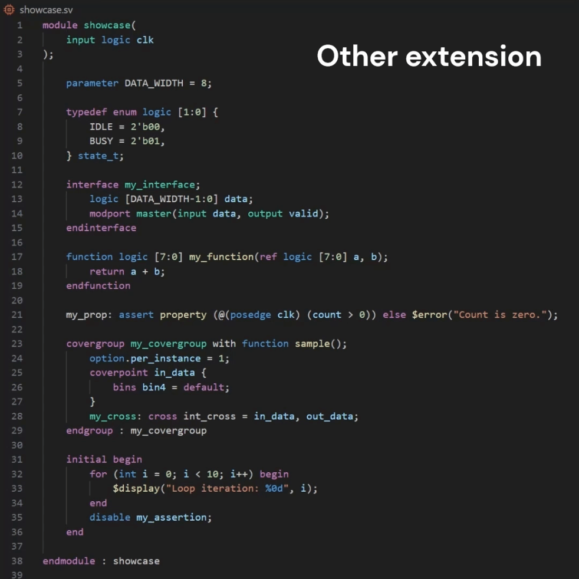

# Better SystemVerilog Syntax for Visual Studio Code

## Introduction

Welcome to *Better SystemVerilog Syntax*! This extension enhances your coding experience by providing advanced TextMate grammar support, specifically designed to improve SystemVerilog syntax highlighting. Our aim is to make your coding sessions more enjoyable and productive by enhancing readability and aesthetics.

## Features

### Refined Syntax Highlighting

Enjoy more precise and visually appealing syntax highlighting with our meticulously refined tmLanguage grammar. We've covered most SystemVerilog features to ensure your code stands out.

### Robust Highlighting Mechanisms

Our syntax highlighting adapts and remains robust, maintaining clarity even with incomplete or unconventional code structures:

- **Immediate Recognition**: Syntax elements are highlighted as soon as they're detected. Partially written code identified by leading keywords becomes readable instantly.

- **Resilient Parsing**: Our parser handles scenarios like improperly terminated code structures. For example, if a function within a module isn't closed correctly, the rest of your code retains its syntax highlighting integrity.

### Minimized TextMate JSON File

We've optimized our extension by implementing JSON file minification, reducing its size to about 90% of the original for smooth and efficient operation.

## How to Contribute

Your contributions are highly valued! Whether you create pull requests or simply report issues regarding incorrect highlighting, your input helps us improve.

## License

This extension is available under the MIT License. For more details, please refer to the [LICENSE.md](LICENSE.md) file.
