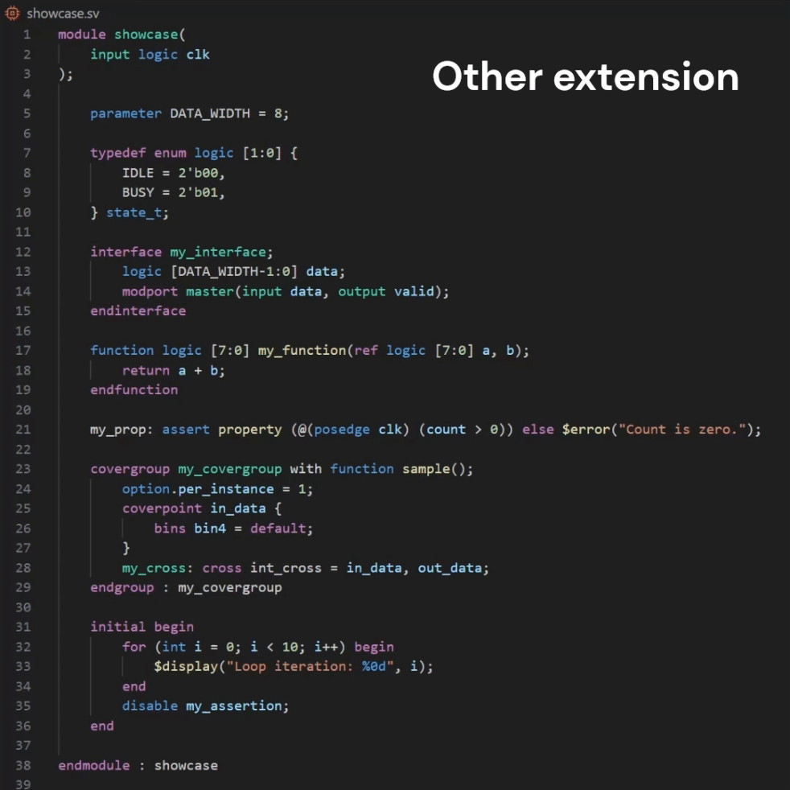

# Better SystemVerilog Syntax for Visual Studio Code

[](https://github.com/hankhsu1996/vscode-better-systemverilog-syntax/actions/workflows/vscode-extension-ci.yml)


## Introduction

Welcome to _Better SystemVerilog Syntax_! This extension enhances your coding experience by providing advanced TextMate grammar support, specifically designed to improve SystemVerilog syntax highlighting. Our aim is to make your coding sessions more enjoyable and productive by enhancing readability and aesthetics.



## Getting Started

1. **Install the Extension**: You can find _Better SystemVerilog Syntax_ in the VS Code Marketplace. Just search for it and click 'Install'.
2. **Activate Syntax Highlighting**: Once installed, open any `.sv` or `.svh` file, and enjoy enhanced syntax highlighting tailored for SystemVerilog.

## Supported Syntax

Here's a summary of the SystemVerilog syntax support, categorized by chapter:

| Chapter | Title                                          | Status             |
| ------- | ---------------------------------------------- | ------------------ |
| 5       | Lexical conventions                            | 🟢 Implemented     |
| 6       | Data types                                     | 🟢 Implemented     |
| 7       | Aggregate data types                           | 🟢 Implemented     |
| 8       | Classes                                        | 🟢 Implemented     |
| 9       | Processes                                      | 🟢 Implemented     |
| 10      | Assignment statements                          | 🟢 Implemented     |
| 11      | Operators and expressions                      | 🟢 Implemented     |
| 12      | Procedural programming statements              | 🟢 Implemented     |
| 13      | Tasks and functions (subroutines)              | 🟢 Implemented     |
| 14      | Clocking blocks                                | 🟢 Implemented     |
| 15      | Interprocess synchronization and communication | 🟢 Implemented     |
| 16      | Assertions                                     | 🟢 Implemented     |
| 17      | Checkers                                       | 🔴 Not Implemented |
| 18      | Constrained random value generation            | 🟢 Implemented     |
| 19      | Functional coverage                            | 🔴 Not Implemented |
| 20      | Utility system tasks and system functions      | 🟢 Implemented     |
| 21      | Input/output system tasks and system functions | 🟢 Implemented     |
| 22      | Compiler directives                            | 🟢 Implemented     |
| 23      | Modules and hierarchy                          | 🟢 Implemented     |
| 24      | Programs                                       | 🟢 Implemented     |
| 25      | Interfaces                                     | 🟢 Implemented     |
| 26      | Packages                                       | 🟢 Implemented     |
| 27      | Generate constructs                            | 🔴 Not Implemented |
| 28      | Gate-level and switch-level modeling           | 🔴 Not Implemented |
| 29      | User-defined primitives                        | 🔴 Not Implemented |
| 30      | Specify blocks                                 | 🟢 Implemented     |
| 31      | Timing checks                                  | 🟢 Implemented     |
| 32      | Backannotation using the standard delay format | 🔴 Not Implemented |
| 33      | Configuring the contents of a design           | 🟢 Implemented     |
| 34      | Protected envelopes                            | 🔴 Not Implemented |

## Library Map Files

Library map files (IEEE 1800 clause 33.3) are highlighted as their own language, _SystemVerilog Library Map_:

```
library rtlLib *.v;
library gateLib ./*.vg, ../cells/.../*.v -incdir ./inc;
include ../other/lib.map;
```

The standard leaves the name of this file to each tool, so only a file named `lib.map`, the name the standard uses in its examples, is recognized automatically. For any other name, pick the language from the language selector in the status bar, or add an association to your settings:

```json
"files.associations": {
  "*.libmap": "systemverilog-libmap"
}
```

## Features

### Enhanced Syntax Highlighting

- **Precision**: SystemVerilog syntax is highlighted with unmatched accuracy, ensuring clarity and focus.
- **Robustness**: Even incomplete or unconventional code structures maintain readability and aesthetics.
- **Efficiency**: Minified JSON files ensure quick loading times and minimal performance overhead.

## How to Contribute

Your contributions are essential for ongoing improvements! Here’s how you can help:

- **Issue Reporting**: If you encounter incorrect syntax highlighting, please [open an issue](https://github.com/hankhsu1996/vscode-better-systemverilog-syntax/issues).
- **Pull Requests**: For those looking to contribute code, especially for unimplemented chapters, feel free to submit a pull request. Be sure to include tests!

## License

This project is licensed under the MIT License, meaning it’s free for personal and commercial use. For full details, see the [LICENSE](LICENSE) file.
